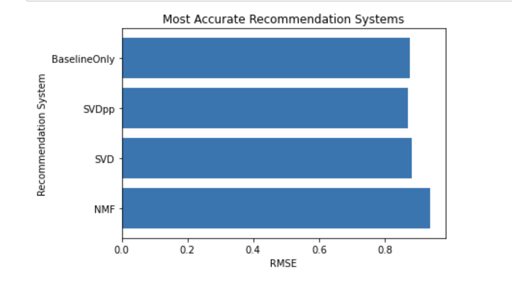

# Movie Recommendation System

Author: Kregg Jackson

## Project Overview

This project was built for a website designed to make personalized movie recommendations to the user based off their ratings of movies.

## The Data

The data set is a dictionary of two dataframes one with movie data and the other with ratings data. The movies dataframe has 9,700 rows of three columns with `movieId`, `title`, and `genre` data. The ratings column originally had over 100,000 rows of reviews with four columns of `userId`, `movieId`, `rating`, and `timestamp`.

## Methods

I built a function to run multiple recommender systems and return the movie recommendations after first cleaning and evaluating the data. The cleaning process consisted of formatting the data and dropping irrelevant columns. Next I built vizs to visually represent and better understand the data and accuracy of the recommender systems. I found the best parameters for the lowest Root means squared error (RMSE), obtained a prediction for a specific user for a particular item, and created another function that will return the top 5 movie recommendations for a user.

## Results

### SVD, BaselineOnly, & SVD ++ Results

## Conclusions

* The best performing recommendation system is the SVD ++ system with a RMSE of 0.86.

* Multiple recommendation syatems are tuned and able to predict user preference within 0.9 points of the actual rating on average.

* The movie suggestion website will be able to take users previous rating and recommend movies the user has not seen.

### Next Steps

* Have recommendation system not only suggest singular movies but movie genres.

* Running gridsearch on SVD++ was very taxing on my machine’s CPU with more time I could test more parameters to see if I could lower the RMSE of the mos accurate system.

* Build a function to accept new user data.

## For More Information
See the full anaysis in the [Jupyter Notebook](https://github.com/kreggthegoat/dsc-phase-4-project/blob/main/dsc-phase-4-project/notebook.ipynb) or review the [presentation](https://github.com/kreggthegoat/dsc-phase-4-project/blob/main/presentation4.pdf).

## Thank You
