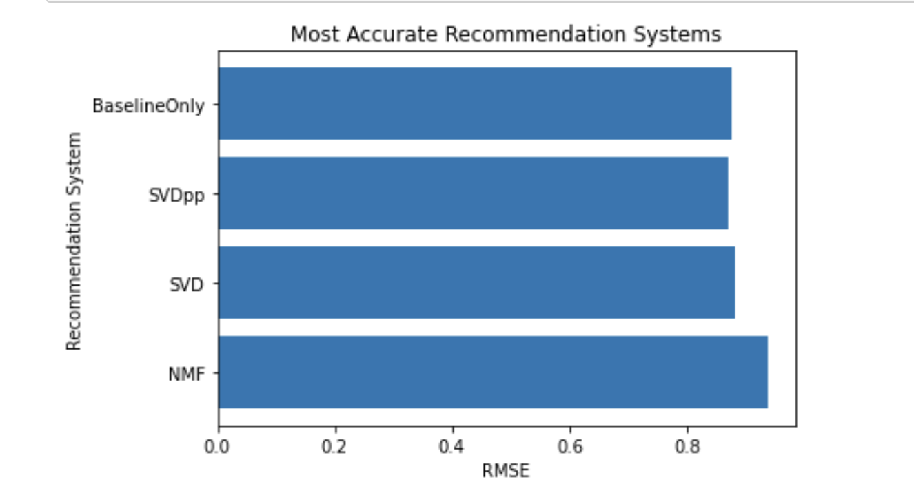

# Phase 4 Project : Movie Recommendation System

Author: Kregg Jackson

## Project Overview

This project was built for a website designed to make personalized movie recommendations to the user based off their ratings of movies.

## The Data

The data set is a dictionary of two dataframes one with movie data and the other with ratings data. The movies dataframe has 9,700 rows of three columns with `movieId`, `title`, and `genre` data. The ratings column originally had over 100,000 rows of reviews with four columns of `userId`, `movieId`, `rating`, and `timestamp`.

## Methods

I a function to run multiple recommender systems after cleaning and evaluating the data. The cleaning process consisted of formatting the data and dropping irrelevant columns. Next I built vizs to visually represent and better understand the data and accuracy of the recommender systems. I found the best parameters for the lowest Root means squared error (RMSE), obtained a prediction for a specific user for a particular item, and created another function that will return the top 5 movie recommendations for a user.

## Results

### SVD, BaselineOnly, & SVD ++ results

## Conclusions

* 

*  

* 

### Next Steps

* 

* 

* 

## For More Information
See the full anaysis in the [Jupyter Notebook](https://github.com/kreggthegoat/dsc-phase-4-project/blob/main/notebook.ipynb) or review the [presentation](https://docs.google.com/presentation/d/174zcuoWgsycaIz37OTiJlBuSdv70IHLxPT8SHQHGEhY/edit?usp=sharing).

## Thank You